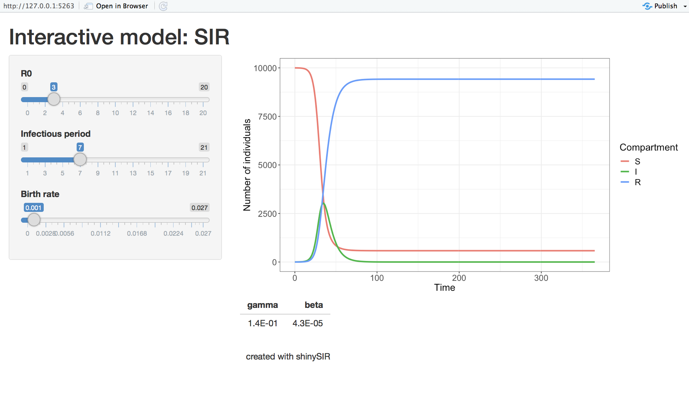
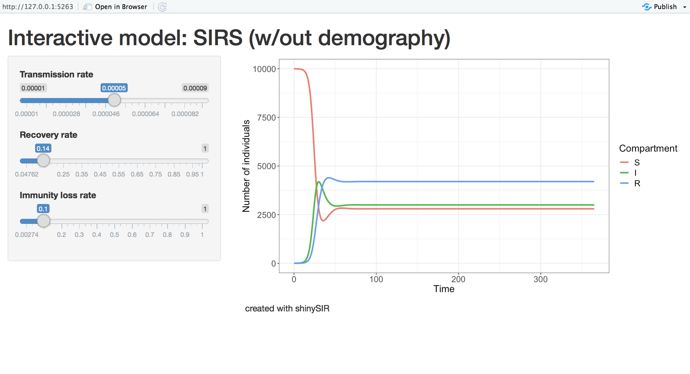

[](https://travis-ci.com/SineadMorris/shinySIR)

shinySIR
========

`shinySIR` provides interactive plotting for mathematical models of infectious disease spread. Users can choose from a variety of common built-in ODE models (such as the SIR, SIRS, and SIS models), or create their own. This latter flexibility allows `shinySIR` to be applied to simple ODEs from any discipline. The package is a useful teaching tool as students can visualize how changing different parameters can impact model dynamics, with minimal knowledge of coding in R. The built-in models are inspired by those featured in the references below \[1-4\].

Basic information
-----------------

###### Author and maintainer

Sinead E Morris

###### Contributors

Ottar N Bjørnstad

###### Citing this package

Citation information can be found with `citation("shinySIR")`.

###### Getting help

If you encounter any bugs related to this package please contact the author directly. Additional descriptions of the mathematical theory and package functionality can be found in the vignette. Further details on the mathematical theory can also be found in the references listed below \[1-4\].

Quick start example
-------------------

The package can be installed from CRAN by running

``` r
install.packages("shinySIR")
```

To instead install from Github, first install and load `devtools`, then install `shinySIR` as follows

``` r
install.packages("devtools")
library("devtools")

install_github("SineadMorris/shinySIR")
```

To create an interactive plot of the SIR (susceptible-infected-recovered) model simply load the package and use the `run_shiny()` command. A window, similar to the one below, will appear. This shows the dynamics of the SIR model at the default parameter starting values; you can then change these values to explore their impact on model dynamics.

``` r
library(shinySIR)

run_shiny(model = "SIR")
```



### Built-in models

A number of common models are supplied with the package. These include the SIR, SIRS, and SIS models. These can be accessed using the `model` argument, as shown above for the SIR model. The built-in models are parameterized using *R*<sub>0</sub> and the infectious period (1/*γ*), since these may be more intuitive for new students than the slightly abstract transmission rate (*β*) and recovery rate (*γ*). The values for *β* and *γ* are calculated from the other parameters and printed in a table below the graph (as shown in the SIR example above).

A comprehensive description of all built-in models and default parameters are given in the package vignette. Brief information can also be obtained by calling `default_models()`.

### User-defined models

Users can also specify their own models using the `neweqns` argument. `neweqns` takes a function containing the equations for the new model, with syntax as outlined in the example below. Note the syntax follows that used by the popular ODE solver `deSolve`.

``` r
mySIRS <- function(t, y, parms) {

    with(as.list(c(y, parms)),{

        # Change in Susceptibles
        dS <- - beta * S * I + delta * R

        # Change in Infecteds
        dI <- beta * S * I - gamma * I

        # Change in Recovereds
        dR <- gamma * I - delta * R

    return(list(c(dS, dI, dR)))
    })
}
```

The interactive plot can then be created by calling this function with `neweqns`, specifying initial conditions for all model variables (`ics`), and specifying vectors for the parameter attributes, including parameter starting values (`parm0`), names to be displayed in the interactive menu (`parm_names`), and minimum and maximum values for the interactive menu (`parm_min` and `parm_max`, respectively).

``` r

run_shiny(model = "SIRS (w/out demography)", 
          neweqns = mySIRS,
          ics = c(S = 9999, I = 1, R = 0),
          parm0 = c(beta = 5e-5, gamma = 1/7, delta = 0.1),
          parm_names = c("Transmission rate", "Recovery rate", "Loss of immunity"),
          parm_min = c(beta = 1e-5, gamma = 1/21, delta = 1/365),
          parm_max = c(beta = 9e-5, gamma = 1 , delta = 1))
```



References
----------

1.  RM Anderson and R May (1992) Infectious Diseases of Humans: Dynamics and Control. Oxford Science Publications.

2.  MJ Keeling and P Rohani (2008) Modeling Infectious Diseases in Humans and Animals. Princeton University Press.

3.  ON Bjørnstad (2018) Epidemics: Models and Data using R. Springer.

4.  DJD Earn, P Rohani, BM Bolker, BT Grenfell (2000) A simple model for complex dynamical transitions in epidemics. *Science* 287: 667-670
