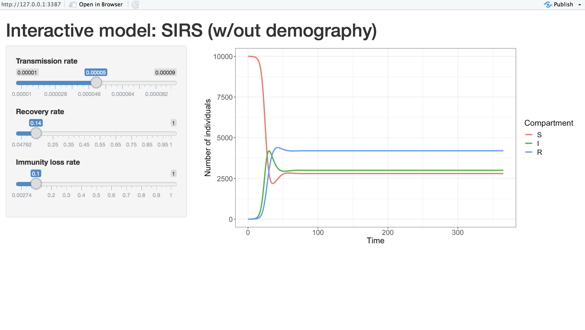

```{r, include = FALSE}
knitr::opts_chunk$set(
  collapse = TRUE, echo = TRUE, fig.height = 6, fig.width = 8, message = FALSE, warning = FALSE
)
```

`shinySIR` provides interactive plotting for mathematical models of infectious disease spread. Users can choose from a variety of common built-in ODE models (such as the SIR, SIRS, and SIS models), or create their own. This latter flexibility allows shinySIR to be applied to simple ODEs from any discipline. The package is a useful teaching tool as students can visualize how changing different parameters can impact model dynamics, with minimal knowledge of coding in R. Models are inspired by those featured in the references below [1-4].


## Basic information


###### Author and maintainer

Sinead E Morris


###### Contributors

Ottar N Bj&#248;rnstad


###### Citing this package

Citation information can be found with `citation("shinySIR")`.


###### Getting help

If you encounter any bugs related to this package please contact the author directly. Additional descriptions of the mathematical theory and package functionality can be found in the vignette. Further details on the mathematical theory can also be found in the references listed below [1-4].


## Quick start example

The package can be installed from CRAN by running

```{r install0, eval = FALSE}
install.packages("shinySIR")

```

To instead install from Github, first install and load `devtools`, then install `shinySIR` as follows

```{r install, eval = FALSE}
install.packages("devtools")
library("devtools")

install_github("SineadMorris/shinySIR")

```


To create an interactive plot of the SIR (susceptible-infected-recovered) model simply load the package and use the `run_shiny()` command. A window, similar to the one below, will appear. This shows the dynamics of the SIR model at the default parameter starting values; you can then change these values to explore their impact on model dynamics.

```{r SIR, eval = FALSE}
library(shinySIR)

run_shiny(model = "SIR")

```

```{r echo = FALSE}
library(shinySIR)
```

{width=700px}


### Model specification

A number of common models are supplied with the package, including the SIR, SIRS, and SIS models. They can be accessed using the `model` argument, as shown above for the SIR model. These built-in models are parameterized using $R_0$ and the infectious period ($1/\gamma$), since these may be more intuitive for new students than the slightly abstract transmission rate ($\beta$) and recovery rate ($\gamma$). The values for $\beta$ and $\gamma$ are calculated from the other parameters and printed in a table below the graph (as shown in the SIR example above). A comprehensive description of all built-in models is given below. Brief information can also be obtained by calling `default_models()`.


### User-defined models

Users can also specify their own models using the `neweqns` argument. `neweqns` takes a function containing the equations for the new model, with syntax as outlined in the example below. Note the syntax follows that used by the popular ODE solver `deSolve`.


```{r mymodel, eval = FALSE}
mySIRS <- function(t, y, parms) {

    with(as.list(c(y, parms)),{

        # Change in Susceptibles
        dS <- - beta * S * I + delta * R

        # Change in Infecteds
        dI <- beta * S * I - gamma * I

        # Change in Recovereds
        dR <- gamma * I - delta * R

    return(list(c(dS, dI, dR)))
    })
}

```

The interactive plot can then be created by calling this function with `neweqns`, specifying initial conditions for all model variables (`ics`), and specifying vectors for the parameter attributes, including parameter starting values (`parm0`), names to be displayed in the interactive menu (`parm_names`), and minimum and maximum values for the interactive menu (`parm_min` and `parm_max`, respectively).

```{r mymodel_run, eval = FALSE}

run_shiny(model = "SIRS (w/out demography)", 
          neweqns = mySIRS,
          ics = c(S = 9999, I = 1, R = 0),
          parm0 = c(beta = 5e-5, gamma = 1/7, delta = 0.1),
          parm_names = c("Transmission rate", "Recovery rate", "Loss of immunity"),
          parm_min = c(beta = 1e-5, gamma = 1/21, delta = 1/365),
          parm_max = c(beta = 9e-5, gamma = 1 , delta = 1))

```


{width=700px}


## Built-in models

Interactive plots can be generated for all built-in models using the `run_shiny()` function with the `model` argument. Starting parameters and parameter ranges will be specified by default, but these can be modified if desired using the arguments `parm0`, `parm_names`, `parm_min`, and `parm_max` (described above). The built-in models are detailed below, with their corresponding equations, `model` arguments, and default parameter attributes.

### SIR

`model = "SIR"`

In the simple SIR model (without births or deaths), susceptible individuals ($S$) become infected and move into the infected class ($I$). After some period of time, infected individuals recover and move into the recovered (or immune) class ($R$). Once immune, they remain so for life (i.e. they do not leave the recovered class). The corresponding equations are given by 
$$\begin{align*}
\frac{dS}{dt} &= -\beta S I\\
\frac{dI}{dt} &= \beta S I - \gamma I\\
\frac{dR}{dt} &=  \gamma I.
\end{align*}$$


where $S, I$, and $R$, are the numbers of susceptible, infected, and recovered individuals in the population. Suppose the unit of time we are considering is days, then

* $\beta$ is the transmission rate and $\beta S I$ represents the number of susceptible individuals that become infected per day;
* $\gamma$ is the recovery rate and $\gamma I$ is the number of infected individuals that recover per day;
* $1/\gamma$ is the infectious period i.e. the average duration of time an individual remains infected.

An important quantity of any disease model is the the reproductive number, $R_0$, which represents the average number of secondary infections generated from one infectious individual in a completely susceptible population. For the SIR model, $$R_0 = \beta N / \gamma, $$ where $N = S + I + R$ is the total (constant) population size. Since $R_0$ and the infectious period are more intuitive parameters, we use these as inputs for the built-in SIR model. We can then calculate $\beta$ as $$\beta = R_0 \gamma / N.$$ 

The default parameter arguments for the SIR model are:

* `parm0 = c(R0 = 3, Ip = 7)`
* `parm_names = c("R0", "Infectious period")`
* `parm_min = c(R0 = 0, Ip = 1)`
* `parm_max = c(R0 = 20, Ip = 21)`

These can also be viewed by calling `get_params(model = "SIR")`.


#### SIR with demography

`model = "SIRbirths"`

We can also add births into the SIR model. Assuming the birth rate is equal to the death rate ($\mu$) gives:
$$\begin{align*}
\frac{dS}{dt} &= \mu N -\beta S I - \mu S\\
\frac{dI}{dt} &= \beta S I - \gamma I - \mu I\\
\frac{dR}{dt} &=  \gamma I - \mu R.
\end{align*}$$

Then

* $\mu N$ represents the number of births into the population per unit time (we assume everyone is born susceptible)
* $\mu S$ (or $\mu I$/ $\mu R$) is the number of susceptible (or infected/ immune) individuals that die per unit time.

For this model, $$R_0 = \beta N / (\gamma + \mu), $$ and so $$\beta = R_0 (\gamma + \mu) / N.$$

The default parameter arguments  are:

* `parm0 = c(R0 = 3, Ip = 7, mu = round(0.25/365, 3))`
* `parm_names = c("R0", "Infectious period", "Birth rate")`
* `parm_min = c(R0 = 0, Ip = 1, mu = 0)`
* `parm_max = c(R0 = 20, Ip = 21, mu = round(10/365, 3))`

These can also be viewed by calling `get_params(model = "SIRbirths")`. Note the `round(..., 3)` function rounds the parameter value to 3 decimal points. This improves readability for the shiny app slider scale.


#### SIR with vaccination at birth

`model = "SIRvaccination"`

To incorporate vaccination, assume a proportion, $p$, of new births into the population are vaccinated (and thus immune to infection). Those that are vaccinated will avoid the susceptible class and go straight to the recovered class, whereas those that are unvaccinated will go into the susceptible class as before. If $p$ is the proportion vaccinated, then $1 - p$ is the proportion left unvaccinated, and the equations become:

$$\begin{align*}
\frac{dS}{dt} &= \mu N (1 - p) -\beta S I - \mu S\\
\frac{dI}{dt} &= \beta S I - \gamma I - \mu I\\
\frac{dR}{dt} &=  \gamma I - \mu R + \mu N p.
\end{align*}$$

Here

* $\mu N p$ is the number of newborns vaccinated per unit time and $\mu N (1 - p)$ is the number not vaccinated.
* $R_0$ is the same as in the SIR model with demography

The default parameter arguments are:

* `parm0 = c(R0 = 3, Ip = 7, mu = round(0.25/365, 3), p = 0.75)`
* `parm_names = c("R0", "Infectious period", "Birth rate", "Proportion vaccinated")`
* `parm_min = c(R0 = 0, Ip = 1, mu = 0, p = 0)`
* `parm_max = c(R0 = 20, Ip = 21, mu = round(10/365, 3), p = 1)`

These can also be viewed by calling `get_params(model = "SIRvaccination")`.

### SIS

`model = "SIS"`

For the SIS model, susceptible individuals ($S$) become infected and move into the infected class ($I$), and then infected individuals who recover move straight back to the susceptible class (so there's no period of immunity like in the SIR model).

The corresponding equations (without demography) are
\begin{align*}
\frac{dS}{dt} &= - \beta S I + \gamma I\\
\frac{dI}{dt} &= \beta S I - \gamma I.
\end{align*}

As in the SIR model without demography, $$R_0 = \beta N / \gamma, $$ and so $$\beta = R_0 \gamma / N.$$

The default parameter arguments are:

* `parm0 = c(R0 = 3, Ip = 7)`
* `parm_names = c("R0", "Infectious period")`
* `parm_min = c(R0 = 0, Ip = 1)`
* `parm_max = c(R0 = 20, Ip = 21)`

These can also be viewed by calling `get_params(model = "SIS")`.

#### SIS with demography

`model = "SISbirths"`

Similar to the SIR model, we add in demography by assuming the birth rate is equal to the death rate ($\mu$):
$$\begin{align*}
\frac{dS}{dt} &= \mu N -\beta S I + \gamma I - \mu S\\
\frac{dI}{dt} &= \beta S I - \gamma I - \mu I\\
\end{align*}$$

It follows that $$R_0 = \beta N / (\gamma + \mu), $$ and so $$\beta = R_0 (\gamma + \mu) / N.$$

The default parameter arguments are:

* `parm0 = c(R0 = 3, Ip = 7, mu = round(0.25/365, 3))`
* `parm_names = c("R0", "Infectious period", "Birth rate")`
* `parm_min = c(R0 = 0, Ip = 1, mu = 0)`
* `parm_max = c(R0 = 20, Ip = 21, mu = round(10/365, 3))`
            
These can also be viewed by calling `get_params(model = "SISbirths")`.

### SIRS

`model = "SIRS"`

The SIRS model is similar to the SIR model in that individuals become immune to the disease once they recover. However, instead of remaining immune for life (i.e. staying in the $R$ class), they can instead lose this immunity (at rate $\delta$) and re-enter the susceptible class. The equations are given by

$$\begin{align*}
\frac{dS}{dt} &= -\beta S I + \delta R\\
\frac{dI}{dt} &= \beta S I - \gamma I\\
\frac{dR}{dt} &=  \gamma I - \delta R.
\end{align*}$$

Here

* $\delta R$ is the number of recovered individuals losing immunity per unit time
* $1/\delta$ is the duration of immunity i.e. the average period of time an individual remains immune/recovered.

As with the SIR model, $$R_0 = \beta N /\gamma $$ and so $$\beta = R_0 \gamma/ N.$$

Since the duration of immunity (`Rp`) may be a more intuitive quantity to parameterize than the rate of immune loss, we use this as an input alongside $R_0$ and the infectious period. The default parameter arguments are:

* `parm0 = c(R0 = 3, Ip = 7, Rp = 365)`
* `parm_names = c("R0", "Infectious period", "Duration of immunity")`
* `parm_min = c(R0 = 0, Ip = 1, Rp = 30)`
* `parm_max = c(R0 = 20, Ip = 21, Rp = 30 * 365)`

These can also be viewed by calling `get_params(model = "SIRS")`.
            
#### SIRS with demography

`model = "SIRSbirths"`

Similar to the SIR and SIS models, we add in demography by assuming the birth rate is equal to the death rate ($\mu$):
$$\begin{align*}
\frac{dS}{dt} &= \mu N -\beta S I + \delta R - \mu S\\
\frac{dI}{dt} &= \beta S I - \gamma I  - \mu I\\
\frac{dR}{dt} &=  \gamma I - \delta R  - \mu R.
\end{align*}$$

It follows that $$R_0 = \beta N / (\gamma + \mu), $$ and so $$\beta = R_0 (\gamma + \mu) / N.$$

The default parameter arguments are:

* `parm0 = c(R0 = 3, Ip = 7, Rp = 365, mu = round(0.25/365, 3))`
* `parm_names = c("R0", "Infectious period", "Duration of immunity", "Birth rate")`
* `parm_min = c(R0 = 0, Ip = 1, Rp = 30, mu = 0)`
* `parm_max = c(R0 = 20, Ip = 21, Rp = 30 * 365, mu = round(10/365, 3))`
            
These can also be viewed by calling `get_params(model = "SIRSbirths")`.


#### SIRS with vaccination

`model = "SIRSvaccination"`

Similar to the SIR mode, we incorporate vaccination by assuming a proportion, $p$, of new births into the population are vaccinated (and thus immune to infection). The equations become:


$$\begin{align*}
\frac{dS}{dt} &= \mu N (1 - p) - \beta S I + \delta R - \mu S\\
\frac{dI}{dt} &= \beta S I - \gamma I - \mu I\\
\frac{dR}{dt} &=  \gamma I - \delta R  - \mu R + \mu N p.
\end{align*}$$


Again $$R_0 = \beta N / (\gamma + \mu), $$ and so $$\beta = R_0 (\gamma + \mu) / N.$$

The default parameter arguments are:

* `parm0 = c(R0 = 3, Ip = 7, Rp = 365, mu = round(0.25/365, 3), p = 0.75)`
* `parm_names = c("R0", "Infectious period", "Duration of immunity", "Birth rate", "Proportion vaccinated")`
* `parm_min = c(R0 = 0, Ip = 1, Rp = 30, mu = 0, p = 0)`
* `parm_max = c(R0 = 20, Ip = 21, Rp = 30 * 365, mu = round(10/365, 3), p = 1)`
            
These can also be viewed by calling `get_params(model = "SIRSvaccination")`.


### More detailed examples

There are also two more detailed examples that include phase plane visualization: the seasonal SEIR model can be run by typing `seir.app`; and the SEIRS model can be run with `seirs.app`.

* `seir.app`: The SEIR model is similar to the SIR model, with an extra compartment for latent infection i.e. once infected, there is a delay (called the 'latent' or 'exposed' phase) in which individuals are infected but not yet infectious. Seasonal forcing in transmission is incorporated using a cosine function. Equations can be viewed by running the app.

* `seirs.app`: The SEIRS model is similar to the SEIR model. However, instead of remaining immune for life, individuals can lose immunity and re-enter the susceptible class. Equations can be viewed by running the app.


## References

1. RM Anderson and R May (1992) Infectious Diseases of Humans: Dynamics and Control. Oxford Science Publications.

2. MJ Keeling and P Rohani (2008) Modeling Infectious Diseases in Humans and Animals. Princeton University Press.

3. ON Bj&#248;rnstad (2018) Epidemics: Models and Data using R. Springer.

4. DJD Earn, P Rohani, BM Bolker, BT Grenfell (2000) A simple model for complex dynamical transitions in epidemics. *Science* 287: 667-670

